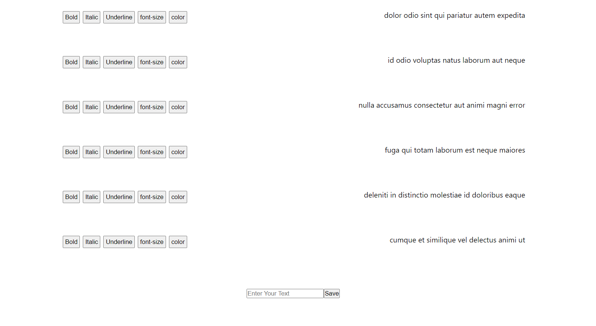

# challenges-test-

## Local Setup (Require Yarn)
1. git clone and cd in first/second
2. yarn install
3. yarn run dev
4. It would run the project in your local machine.

# Project 1 [Live](https://profound-bienenstitch-e903a4.netlify.app/)
It simply apply the css of each button on the next paragraph.You can add your custom input paragraph also.

# Project 2 [Live](https://helpful-hamster-d9a375.netlify.app/)
It is simple grid of photos coming from api with search option to search any photo.

# Images

  

P.S - Will add few more images later.
